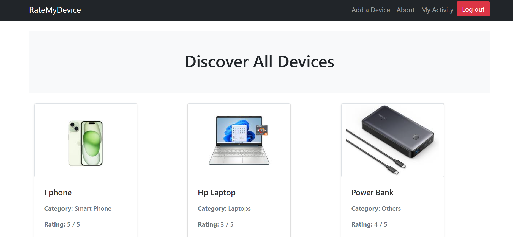
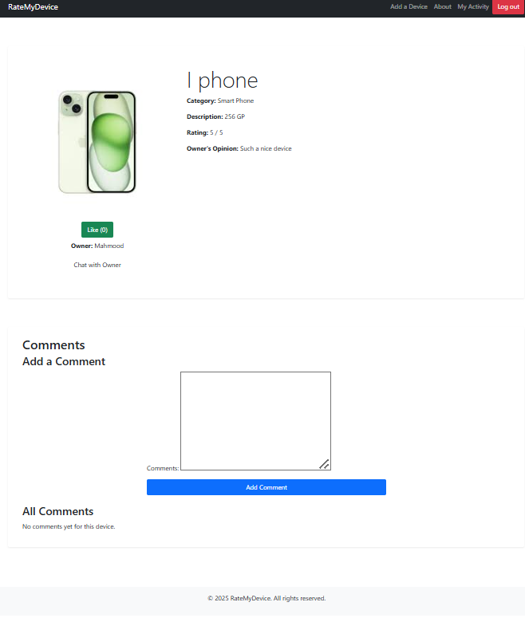
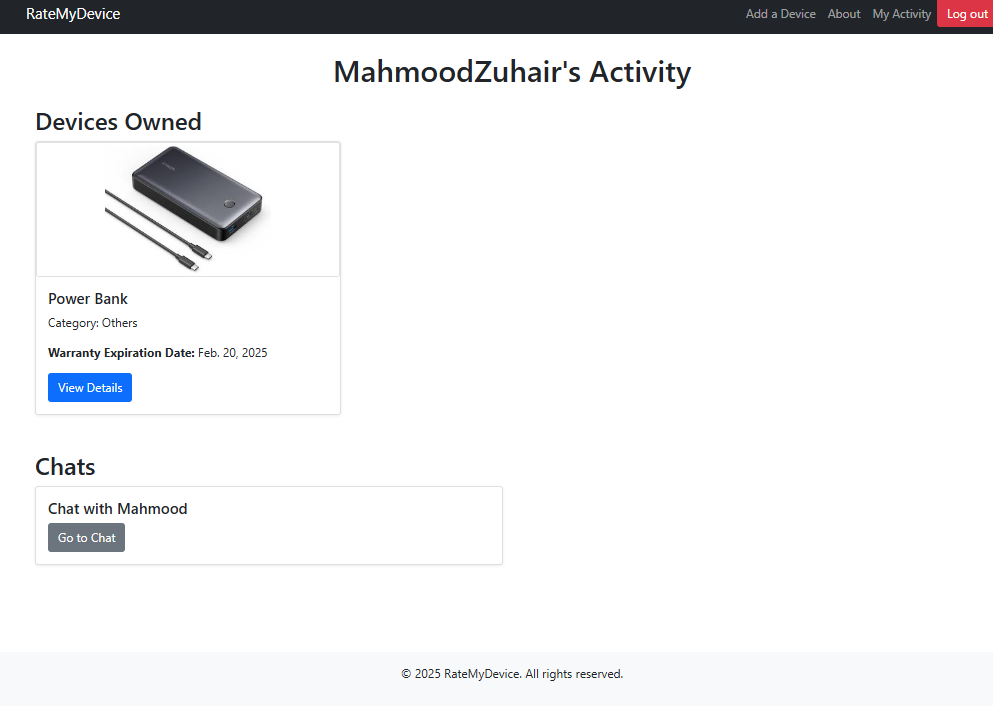
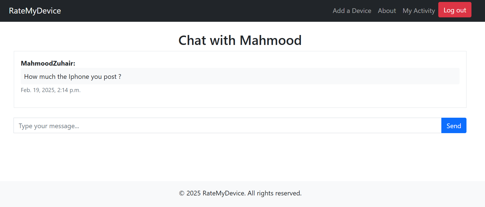

# RateMyDevice

## Screenshot/Logo

## About RateMyDevice
**RateMyDevice** is a web application built using Django that allows users to add new devices they have purchased and provide reviews. Users can rate their devices from 0 to 5 stars, write descriptions, and share their experiences with others. 

### Key Features:
- Users can **add a new device** with its details.
- Users can **edit or delete** their posted devices.
- Other users can **like** a device post and **add comments** to it.
- Users who did not post the device can **chat** with the owner for more details.
- All users can **view their activity**, including their added devices and chat history.
- **Future Work**: Implementing email notifications to inform users when their device's warranty has expired.

### Why We Built It
We created RateMyDevice to provide a community-driven platform where users can share and gain insights about different devices. This helps potential buyers make informed decisions based on real user experiences.

---

## Getting Started
- **Planning Materials**: [RateMyDevice Project Trello Board](https://trello.com/invite/b/67a0f8f15e252cc5b74f1dd4/ATTI31e3eaf9b2a1f05f94c853a3912b1c1306F8C05C/ratemydevice-project)

---

## Attributions
This project was made possible with the help of various external resources. Some of the references we used include:
- [How to upload images in Django](https://how.dev/answers/how-to-upload-images-in-django)

---

## Technologies Used
RateMyDevice is built with the following technologies:
- **Django** (Python web framework)
- **PostgreSQL** (Database management)
- **HTML, CSS** (Frontend)
- **Bootstrap** (Responsive UI framework)

---

## Next Steps
Here are some future enhancements we plan to add:
- Implement email notifications for warranty expiration.
- Improve the UI/UX for a more seamless user experience.
- Enhance search and filtering features for device reviews.
- Add a recommendation system for similar devices.

